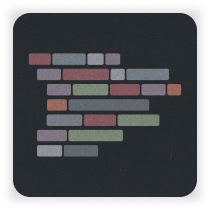
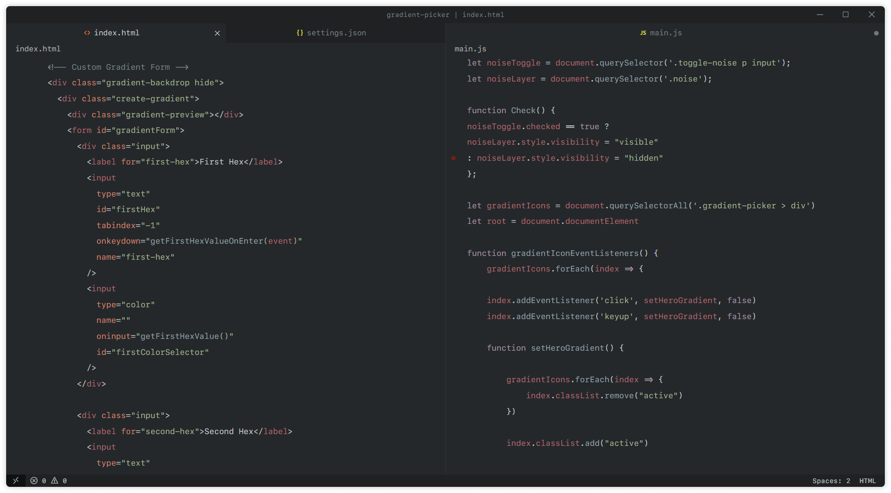
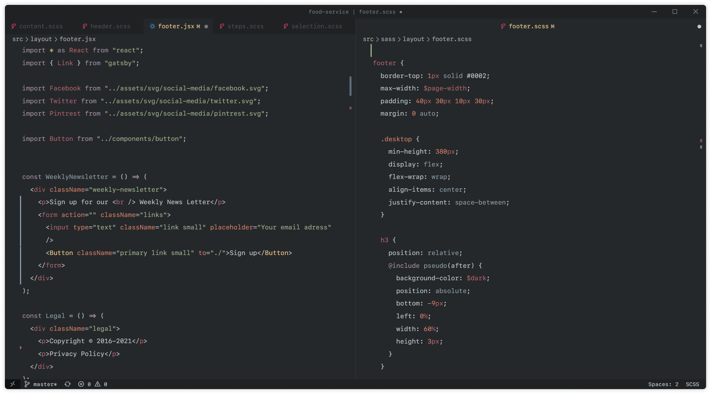
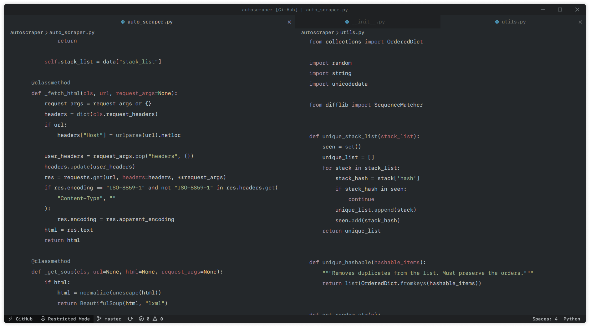

<div style="display: flex; align-items: center; justify-content: center; flex-direction: column;">

<div style="pointer-events: none">



</div>

</div>

<small> HTML & JavaScript</small>

<br />

<small> React & SCSS</small>

<br />

<small> Python</small>


> Darker take on the Base 16 Ocean theme by [Chris Kempson](https://github.com/chriskempson)

## Settings for Minmal Look:

`settings.json`

```json
{
  "window.menuBarVisibility": "compact",
  "editor.renderIndentGuides": false,
  "editor.matchBrackets": "never",
  "editor.renderLineHighlight": "none",
  "editor.occurrencesHighlight": false,
  "editor.folding": false,
  "editor.fontFamily": "SF Mono",
  "editor.lineHeight": 28,
  "editor.lightbulb.enabled": false,
  "editor.scrollbar.vertical": "hidden",
  "editor.scrollbar.horizontal": "hidden",
  "editor.minimap.enabled": false,
  "breadcrumbs.enabled": false
}
```

## Additional Extensions for Customizing VS Code:

Customize UI - _iocave_

GlassIt-VSC - _hikarin522_

Color Highlight - _Sergii Naumov_

<br />

`settings.json`

```json
{
  // Overrides VS Code's UI Font
  "customizeUI.font.regular": "SF Mono",

  "customizeUI.stylesheet": {
    // Removes top left icon and all editor actions in the top right
    ".window-appicon, .tabs .editor-actions": "display: none",

    // Fixes spacing issue with monospaced fonts in the quick open widget
    ".label-description": "white-space: unset !important",

    // Makes tabs fill available space
    ".tabs": "flex-direction: column; display: flex",
    ".tabs .sizing-fit": "flex-grow: 1; text-align: center;",
    ".tabs .monaco-icon-label-container": "flex: unset !important",
    ".tabs .monaco-icon-label": "justify-content: center"
  },

  "glassit.alpha": 240,

  "color-highlight.markerType": "underline",
  "color-highlight.matchWords": true,
  "color-highlight.markRuler": false
}
```
